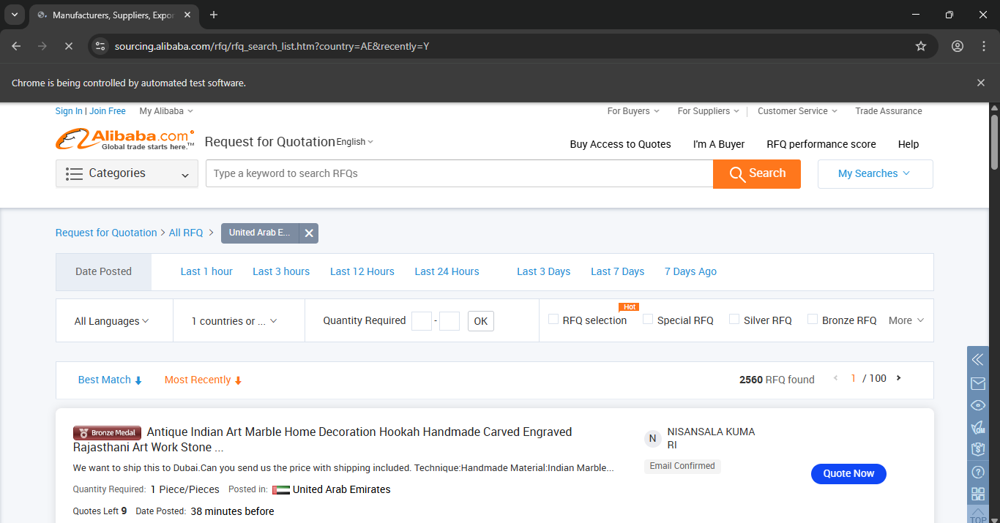
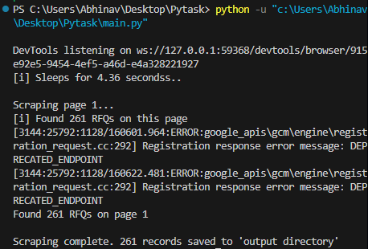
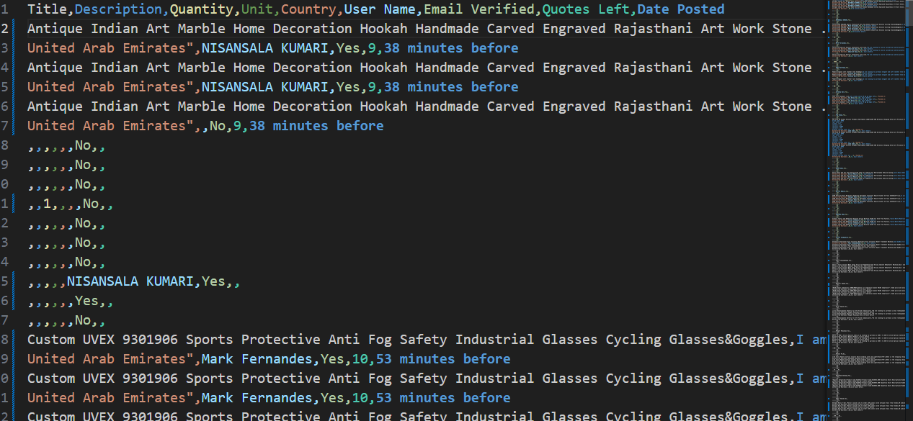

# RFQSpider — Alibaba RFQ Scraper
A high-performance web scraping automation tool built using **Python**, **Selenium**, and **Pandas** to extract **live RFQs (Requests for Quotation)** from Alibaba Sourcing.  
Designed to reduce manual data collection time from *hours to minutes* with reliable automation, wait handling, and structured data export.

---

## Features
- Scrapes **live RFQ listings** from Alibaba Sourcing.
- Captures:
  - Product name  
  - Quantity requirements  
  - Buyer country  
  - Timestamp  
  - Detailed listing information  
- Handles pagination automatically across multiple pages.
- Uses **smart wait timers** and **retry logic** to avoid failures.
- Exports all scraped data to **CSV / Excel** using Pandas.
- Optimized to scrape **10,000+ listings** with high accuracy.

---

## Tech Stack
- **Python 3**
- **Selenium WebDriver**
- **Pandas**
- **ChromeDriver** (or your preferred browser driver)

---

## 📸 Screenshots

<!-- Row 1 -->

  
  

<!-- Row 2 -->

  

